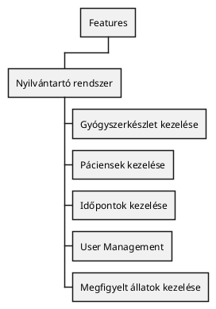
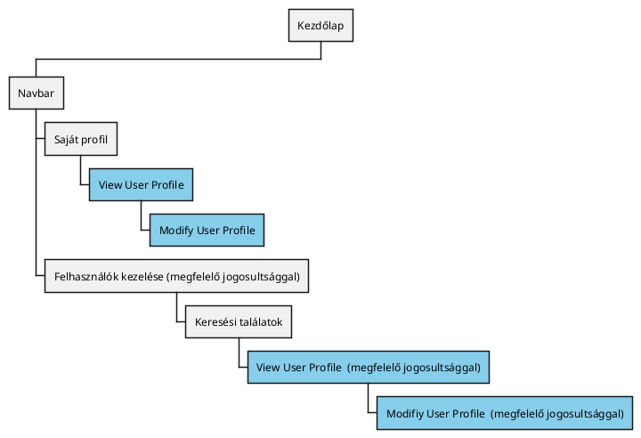
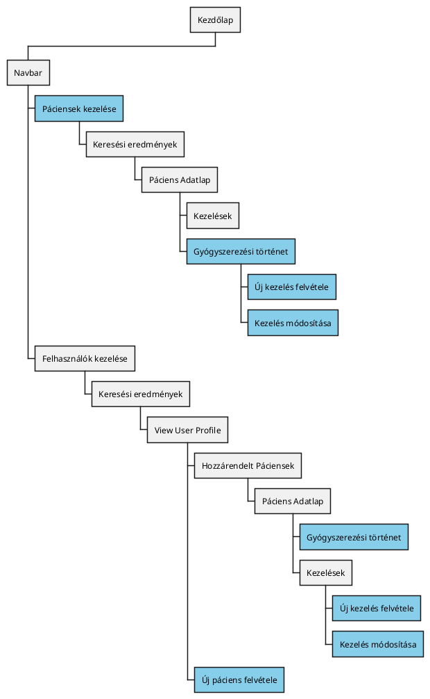
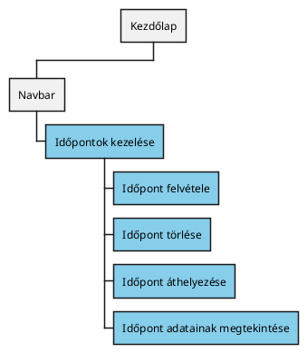
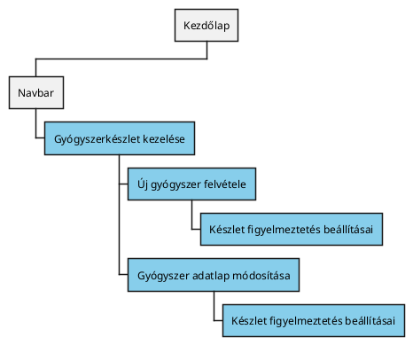
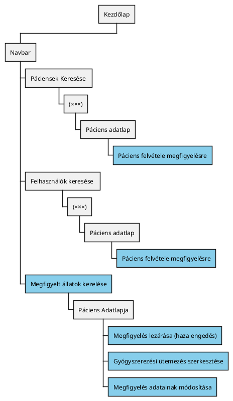

# Funkcionális Követelmények (FRS)

## Feature map

## User Management
### Diagram: Funkciók elérése {collapsible="true"}

### User Profile
#### View User Profile
##### User Story Jegyzék:{id="userprofile-viewuserprofile-userstories"}
- [#21](https://github.com/Vizsgaremek-borosd-dekanycs/Vizsgaremek/issues/21)

##### Követelmények:{id="userprofile-viewuserprofile-requirments"}
- Lehetőség saját felhasználói profil megtekintésére
- Lehetőség más felhasználói profiljának megtekintésére megfelelő jogosultsággal
#### Modify User Profile
##### User Story Jegyzék:{id="userprofile-modifyuserprofile-userstories"}
- [#21](https://github.com/Vizsgaremek-borosd-dekanycs/Vizsgaremek/issues/21)
##### Követelmények:
- Lehetőség a felhasználói profil módosítására
- Megfelelő jogok nélkül csak a saját profilt lehet módosítani
- Következő adatok megadására lehetőség:
  - Név
  - Telefonszám
  - Email
  - Személyi igazolvány szám
  - Irányítószám
  - Lakcím
  - Emelet (opcionális)
  - Ajtószám (opcionális)
- Opcionális adatokon kívül mindent ki kell tölteni.

## Páciensek kezelése
### Diagram: Funkciók elérése{collapsible="true" id="patientmanagement-featurediagram"}

### Új kezelés felvétele
##### User Story Jegyzék:{id="patientmanagement-newtreatment-userstories"}
- [#11](https://github.com/Vizsgaremek-borosd-dekanycs/Vizsgaremek/issues/11)
#### Követelmények: {id="patientmanagement-newtreatment-requirments"}
- Lehetőség egy új kezelés felvételére
- Lehetőség a következő adatok felvételére:
  - Diagnózis
  - Gyógymód
  - Megjegyzés (opcionális)
  - Felírt gyógyszerek és ütemezése (opcionális)
    - Elvárt adatok:
      - Ütemezés
      - Gyógyszer
      - Mennyiség
      - Mértékegység- Ha bármelyik mező, Akkor nem engedi az adat rögzítését és a mező alatt kiírja a hibát.
- Ha a név nem csak betűből áll, Akkor nem engedi az adat rögzítését és a mező alatt kiírja a hibát.
- Ha a diagnózis nem csak betűből áll, Akkor nem engedi az adat rögzítését és a mező alatt kiírja a hibát.
- Ha a fentiek alapján sikertelen a feltöltés, Akkor feldob egy ablakot és kiírja, hogy "Hiba".
- Ha szerver miatt sikertelen a feltöltés, Akkor feldob egy ablakot és kiírja, hogy "Hiba".

### Kezelés adatlapjának módosítása
#### Követelmények: {id="patientmanagement-modifytratment-requirments"}
- Lehetőség a kezelés adatlapjának módosítására
- Lehetőség az alábbiak módosítására:
  - Diagnózis
  - Gyógymód
  - Megjegyzés (opcionális)
  - Felírt gyógyszerek és ütemezése (opcionális)
    - Elvárt adatok:
      - Ütemezés
      - Gyógyszer
      - Mennyiség
      - Mértékegység
- Lehetőség a módosítások megtekintésére
- Ha bármelyik mező, Akkor nem engedi az adat rögzítését és a mező alatt kiírja a hibát.
- Ha a név nem csak betűből áll, Akkor nem engedi az adat rögzítését és a mező alatt kiírja a hibát.
- Ha a diagnózis nem csak betűből áll, Akkor nem engedi az adat rögzítését és a mező alatt kiírja a hibát.
- Ha a fentiek alapján sikertelen a feltöltés, Akkor feldob egy ablakot és kiírja, hogy "Hiba".
- Ha szerver miatt sikertelen a feltöltés, Akkor feldob egy ablakot és kiírja, hogy "Hiba".

### Felírt gyógyszerek megtekintése
##### User Story Jegyzék:{id="patientmanagement-viewmedication-userstories"}
- [#12](https://github.com/Vizsgaremek-borosd-dekanycs/Vizsgaremek/issues/12)
#### Követelmények: {id="patientmanagement-viewmedication-requirments"}
- A kezelések során megadott összes gyógyszer (Kezelés adatlap -> Felírt gyógyszerek) listázása időponttal és kezelőorvossal.

### Új páciens felvétele
##### User Story Jegyzék:{id="patientmanagement-newpatient-userstories"}
- [#10](https://github.com/Vizsgaremek-borosd-dekanycs/Vizsgaremek/issues/10)
#### Követelmények: {id="patientmanagement-newpatient-requirments"}
- Lehetőség új páciens felvételére
- Új páciens felvétele a következő adatokkal:
  - Név
  - Faj
  - Fajta
  - Állat neme
  - Életkor
- Ha bármelyik mező üresen marad, Akkor nem engedi az adat rögzítését és a mező alatt kiírja a hibát.
- Ha a név nem csak betűből áll, Akkor nem engedi az adat rögzítését és a mező alatt kiírja a hibát.
- Ha a faj nincs kiválasztva, Akkor nem engedi az adat rögzítését és a mező alatt kiírja a hibát.
- Ha a faj/fajta még nincs az adatbázisban, Akkor be lehessen írni, viszont az adminisztrátor kapjon róla értesítést.
- Ha a fajta nincs kiválasztva,  Akkor nem engedi az adat rögzítését és a mező alatt kiírja a hibát.
- Ha az életkor nem egész szám, Akkor nem engedi az adat rögzítését és a mező alatt kiírja a hibát.
- Ha az állat neme nincs kiválasztva, Akkor nem engedi az adat rögzítését és a mező alatt kiírja a hibát.
- Ha a fentiek alapján sikertelen a feltöltés, Akkor feldob egy ablakot és kiírja, hogy "Hiba".
- Ha szerver miatt sikertelen a feltöltés, Akkor feldob egy ablakot és kiírja, hogy "Hiba".

## Időpontok kezelése
### Diagram: Funkciók elérése {collapsible="true" id="appointmentmanagement-featurediagram"}

### User Story Jegyzék:{id="appointmentmanagement-userstories"}
- [#19](https://github.com/Vizsgaremek-borosd-dekanycs/Vizsgaremek/issues/19)

### Időpont felvétele
**Időpontok kezelése** oldalon egy naptárban ki lehessen jelölni egy időpontot. 
A kijelölés után felugrik egy adatlap amit ki kell tölteni.

#### Követelmények: {id="appointmentmanagement-newappointment-requirments"}
- Lehetőség új időpont létrehozására
- Lehetőség az alábbiak rögzítésére az új időponthoz:
  - Gazda neve
  - Állat neve
  - Dátum és idő
  - Megjegyzés
  - Állatorvos
- Email értesítés a tulajdonosnak az időpont bejegyzéséről
- Amennyiben a tulajdonos még nem regisztrált, a név mellett legyen egy email is.
- Ha az időpont már egy foglalt időponthoz kerül bejegyzésre, Akkor dobjon fel hibát.
- Ha bármelyik mező üresen marad, Akkor nem engedi az adat rögzítését és a mező alatt kiírja a hibát.
- Ha a gazda neve nem csak betűt tartalmaz, Akkor nem engedi az adat rögzítését és a mező alatt kiírja a hibát.
- Ha az állat neve nem csak betűt tartalmaz, Akkor nem engedi az adat rögzítését és a mező alatt kiírja a hibát.

### Időpont törlése
#### Követelmények: {id="appointmentmanagement-deleteappointment-requirments"}
- Lehetőség az időpontok törlésére
- Email értesítés a tulajdonosnak az időpont törléséről

### Időpont áthelyezése
#### Követelmények: {id="appointmentmanagement-moveappointment-requirments"}
- Lehetőség az időpontok áthelyezésére
- Email értesítés a tulajdonosnak az időpont áthelyezéséről
- Ha az időpont már egy foglalt időponthoz kerül áthúzásra, Akkor dobja vissza a kiinduló mezőjébe.

### Időpont adatainak megtekintése
#### Követelmények: {id="appointmentmanagement-viewappointment-requirments"}
- Lehetőség az alábbiak megtekintésére az időpontról:
    - Gazda neve
    - Állat neve
    - Dátum és idő
    - Megjegyzés
    - Állatorvos
- Ha az időpont már egy foglalt időponthoz kerül áthúzásra, Akkor dobja vissza a kiinduló mezőjébe.

### Időpontok kezelése {id="appointmentmanagement-viewappointments"}
#### Követelmények: {id="appointmentmanagement-viewappointments-requirments"}
- Naptár alapú megjelentítés
- Nézet változtatása:
  - Heti
  - Havi
- Lehetőség hogy vissza ugorjon a felhasználó a mai napra
- Lehetőség az időpontok szűrésére állatorvos alapján

## Gyógyszerkészlet kezelése
### Diagram: Funkciók elérése {collapsible="true" id="medicationstockpile-featurediagram"}

### User Story Jegyzék:{id="medicationstockpile-userstories"}
- [#42](https://github.com/Vizsgaremek-borosd-dekanycs/Vizsgaremek/issues/42)
- [#43](https://github.com/Vizsgaremek-borosd-dekanycs/Vizsgaremek/issues/43)
- [#15](https://github.com/Vizsgaremek-borosd-dekanycs/Vizsgaremek/issues/15)

### Új gyógyszer felvétele
#### Követelmények: {id="medicationstockpile-newmedication-requirments"}
- Lehetőség új gyógyszerek felvételére az adatbázisban
- Lehetőség a következők megadására a gyógyszerek felvétele során:
  - Gyógyszer Név
  - Mértékegység (mg, ml, tabletta. stb listából)
  - Készlet alsó limit értéke
  - Készleten lévő gyógyszer mennyisége
  - További megjegyzés
- Ha bármelyik mező üresen marad, Akkor nem engedi az adat rögzítését és a mező alatt kiírja a hibát.
- Ha a gyógyszer neve létezik már, Akkor nem engedi az adat rögzítését és a mező alatt kiírja a hibát.
- Ha a gyógyszer mértékegysége nincs kiválasztva, Akkor nem engedi az adat rögzítését és a mező alatt kiírja a hibát.
- Ha a figyelmeztetés nem csak számot tartalmaz, Akkor nem engedi az adat rögzítését és a mező alatt kiírja a hibát.
- Ha a megjegyzés üres, Akkor nem engedi az adat rögzítését és a mező alatt kiírja a hibát.
- Ha a fentiek alapján sikertelen a feltöltés, Akkor feldob egy ablakot és kiírja, hogy "Hiba".
- Ha szerver miatt sikertelen a feltöltés, Akkor feldob egy ablakot és kiírja, hogy "Hiba".

### Gyógyszer adatlap módosítása
#### Követelmények: {id="medicationstockpile-modifymedication-requirments"}
- Lehetőség a katalógusban szereplő gyógyszerek módosítására
- Lehetőség a következők módosítására:
  - Gyógyszer Név
  - Mértékegység (mg, ml, tabletta. stb listából)
  - Készlet alsó limit értéke
  - Készleten lévő gyógyszer mennyisége
  - További megjegyzés

### Gyógyszerkészlet figyelmeztetés
#### Követelmények: {id="medicationstockpile-stockpilealert-requirments"}
- Készlet alsó limit számának beállítására lehetőség (gyógyszer adatlapján)
- Amennyiben eléri az alsó limitet, az adminisztrátornak a rendszer email értesítést küld
- Amennyiben eléri az alsó limitet, a rendszer Gyógyszerkészlet kezelése oldalon is feltünteti a figyelmeztetést
- Kötelező megadni limitet

## Megfigyelt állatok kezelése
### Diagram: Funkciók elérése {collapsible="true" id="observationmanagement-featurediagram"}

### Megfigyelt állatok megtekintése {id="observationmanagement-view"}
#### Követelmények: {id="observationmanagement-view-requirments"}
- Lehetőség a gyógyszerezési ütemezés megtekintésére (ütemezés diagram)
- Lehetőség a megfigyelt állatok megtekintésére
- Lehetőség a megfigyelt állat adatlapjának megnyitására

### Megfigyelés lezárása {id="observationmanagement-close"}
#### Követelmények: {id="observationmanagement-close-requirments"}
- Lehetőség hogy a megfigyelt állat megfigyelését leállítsák

### Megfigyelés adatainak módosítása {id="observationmanagement-modifydata"}
#### Követelmények: {id="observationmanagement-modifydata-requirments"}
- Lehetőség az alábbiak módosítására: 

