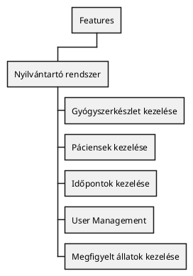
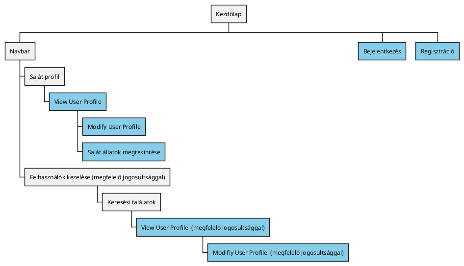
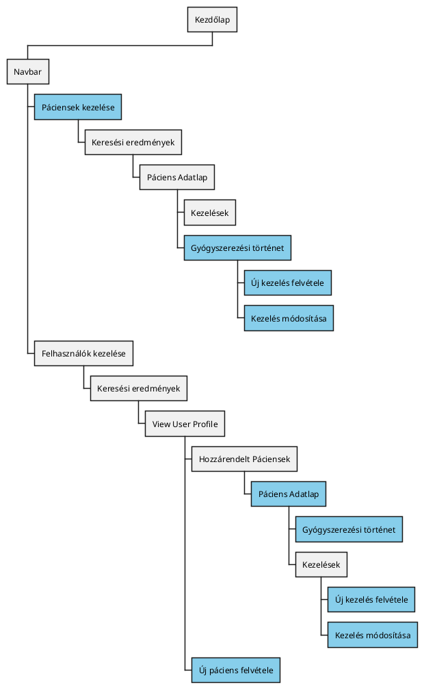
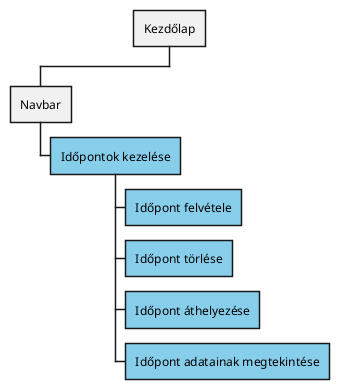
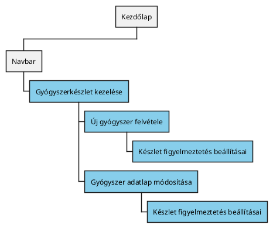
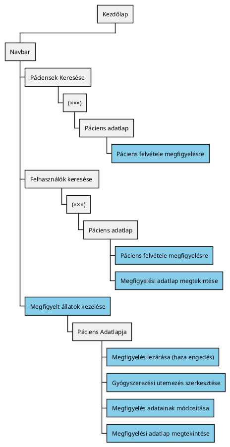

# Funkcionális Követelmények (FRS)

## Feature map

## User Management
### Diagram: Funkciók elérése {collapsible="true"}

### User Profile
#### View User Profile
##### User Story Jegyzék:{id="userprofile-viewuserprofile-userstories"}
- [#21](https://github.com/Vizsgaremek-borosd-dekanycs/Vizsgaremek/issues/21)

##### Követelmények:{id="userprofile-viewuserprofile-requirements"}

- Lehetőség saját felhasználói profil megtekintésére
- Lehetőség más felhasználói profiljának megtekintésére megfelelő jogosultsággal
#### Modify User Profile
##### User Story Jegyzék:{id="userprofile-modifyuserprofile-userstories"}
- [#21](https://github.com/Vizsgaremek-borosd-dekanycs/Vizsgaremek/issues/21)
- [#28](https://github.com/Vizsgaremek-borosd-dekanycs/Vizsgaremek/issues/28)
##### Követelmények:
- Lehetőség a felhasználói profil módosítására
- Megfelelő jogok nélkül csak a saját profilt lehet módosítani
- Következő adatok megadására lehetőség:
  - Név
  - Telefonszám
  - Email
  - Személyi igazolvány szám
  - Irányítószám
  - Lakcím
  - Emelet (opcionális)
  - Ajtószám (opcionális)
- Opcionális adatokon kívül mindent ki kell tölteni.

### Saját állatok adatlapjainak megtekintése
##### User Story Jegyzék: {id="userprofile-viewownpets"}
- [#10](https://github.com/Vizsgaremek-borosd-dekanycs/Vizsgaremek/issues/10)
- [#28](https://github.com/Vizsgaremek-borosd-dekanycs/Vizsgaremek/issues/28)
- [#37](https://github.com/Vizsgaremek-borosd-dekanycs/Vizsgaremek/issues/37)

##### Követelmények: 
- Lehetőség az állatok adatainak külön-külön való megtekintésére.

### Hitelesítés
##### User Story Jegyzék:{id="auth-userstories"}
- [#29](https://github.com/Vizsgaremek-borosd-dekanycs/Vizsgaremek/issues/29)
- [#36](https://github.com/Vizsgaremek-borosd-dekanycs/Vizsgaremek/issues/36)
- [#35](https://github.com/Vizsgaremek-borosd-dekanycs/Vizsgaremek/issues/35)

#### Bejelentkezés

##### Követelmények:{id="auth-login-requirements"}

- Lehetőség bejelentkezésre a nyilvántartóba emaillel és jeleszóval
- Lehetőség elfelejtett jelszó oldal megnyitására
-  Ha az ímélcím nem létezik az adatbázisban vagy nem felel meg a formai szabványoknak, Akkor nem engedi a felhasználó továbblépését és a mező alatt kiírja a hibát.
-  Ha hibás a megadott jelszó, Akkor nem engedi a felhasználó továbblépését és a mező alatt kiírja a hibát.
- Ha a fentiek alapján sikertelen a feltöltés, Akkor feldob egy ablakot és kiírja, hogy "Hiba".
- Ha szerver miatt sikertelen a feltöltés, Akkor feldob egy ablakot és kiírja, hogy "Hiba".

#### Regisztráció

##### Követelmények:{id="auth-register-requirements"}

- Lehetőség regisztrációra az alábbiak megadásával:
  - Email
  - Jelszó
  - Telefonszám
- Opcionálisan megadható legyen a következő értékek:
  - Profilkép
-  Ha az email már használva van vagy nem felel meg a formai szabványoknak, Akkor nem engedi az adat mentését és a mező alatt kiírja a hibát.
-  Ha a két jelszó nem egyezik, Akkor nem engedi az adat mentését és a mező alatt kiírja a hibát.
-  Ha a profilkép mérete nagyobb a megengedettnél, Akkor nem engedi az adat mentését és a mező alatt kiírja a hibát.
-  Ha a telefonszám nem csak 9 számot tartalmaz, Akkor nem engedi az adat mentését és a mező alatt kiírja a hibát.
-  Ha a fentiek alapján sikertelen a feltöltés, Akkor feldob egy ablakot és kiírja, hogy "Hiba".
-  Ha szerver miatt sikertelen a feltöltés, Akkor feldob egy ablakot és kiírja, hogy "Hiba".

#### Elfelejtett jelszó
##### Követelmények:{id="auth-forgotpass-requirements"}
- Lehetőség új jelszó megadására anélkül hogy a régit ismerné a felhasználó (harmadik fél beavatkozása nélkül)

#### Jelszó módosítása
##### Követelmények:{id="auth-newpass-requirements"}

- Lehetőség a régi jelszó lecserélésére harmadik fél beavatkozása nélkül.

### Adminisztrációs funkciók
##### User Story Jegyzék:{id="admin-userstories"}
- [#29](https://github.com/Vizsgaremek-borosd-dekanycs/Vizsgaremek/issues/29)
- [#16](https://github.com/Vizsgaremek-borosd-dekanycs/Vizsgaremek/issues/16)

#### Jelszó módosítása 

##### Követelmények:{id="admin-newpass-requirements"}

- Lehetőség más felhasználó jelszavának  módosítására

#### Felhasználói csoportok

##### Követelmények:{id="admin-usergroups-requirements"}
- Lehetőség felhasználókat felhasználói csoportokba rendelni
- Lehetőség felhasználói csoportokhoz jogosultságokat rendelni
- "jogöröklés": ha egy csoport rendelkezik egy joggal, akkor a felhasználó aki benne van, az is rendelkezzen vele.
- Csoport jogosultságainak szerkesztése
- Lehetőség csoport leírás megadására
- Egy felhasználó több csoportba is tartozhat
- Lehetőség csoportok létrehozására

#### Egyéni jogosultságok

##### Követelmények:{id="admin-customprivileges-requirements"}
- Lehetőség felhasználóhoz közvetlenül jogosultságokat rendelni és elvenni

#### További felhasználói műveletek

##### Követelmények:{id="admin-userfunctions-requirements"}

- Lehetőség a felhasználók közötti keresésre
- Lehetőség a felhasználó korlátozására (nem tud bejelentkezni)

## Páciensek kezelése
### Diagram: Funkciók elérése{collapsible="true" id="patientmanagement-featurediagram"}

### Új kezelés felvétele
##### User Story Jegyzék:{id="patientmanagement-newtreatment-userstories"}
- [#11](https://github.com/Vizsgaremek-borosd-dekanycs/Vizsgaremek/issues/11)

#### Követelmények: {id="patientmanagement-newtreatment-requirements"}

- Lehetőség egy új kezelés felvételére
- Lehetőség a következő adatok felvételére:
  - Diagnózis
  - Gyógymód
  - Megjegyzés (opcionális)
  - Felírt gyógyszerek és ütemezése (opcionális)
    - Elvárt adatok:
      - Ütemezés
      - Gyógyszer
      - Mennyiség
      - Mértékegység- Ha bármelyik mező, Akkor nem engedi az adat rögzítését és a mező alatt kiírja a hibát.
- Ha a név nem csak betűből áll, Akkor nem engedi az adat rögzítését és a mező alatt kiírja a hibát.
- Ha a diagnózis nem csak betűből áll, Akkor nem engedi az adat rögzítését és a mező alatt kiírja a hibát.
- Ha a fentiek alapján sikertelen a feltöltés, Akkor feldob egy ablakot és kiírja, hogy "Hiba".
- Ha szerver miatt sikertelen a feltöltés, Akkor feldob egy ablakot és kiírja, hogy "Hiba".

### Kezelés adatlapjának módosítása

#### Követelmények: {id="patientmanagement-modifytratment-requirements"}

- Lehetőség a kezelés adatlapjának módosítására
- Lehetőség az alábbiak módosítására:
  - Diagnózis
  - Gyógymód
  - Megjegyzés (opcionális)
  - Felírt gyógyszerek és ütemezése (opcionális)
    - Elvárt adatok:
      - Ütemezés
      - Gyógyszer
      - Mennyiség
      - Mértékegység
- Lehetőség a módosítások megtekintésére
- Ha bármelyik mező, Akkor nem engedi az adat rögzítését és a mező alatt kiírja a hibát.
- Ha a név nem csak betűből áll, Akkor nem engedi az adat rögzítését és a mező alatt kiírja a hibát.
- Ha a diagnózis nem csak betűből áll, Akkor nem engedi az adat rögzítését és a mező alatt kiírja a hibát.
- Ha a fentiek alapján sikertelen a feltöltés, Akkor feldob egy ablakot és kiírja, hogy "Hiba".
- Ha szerver miatt sikertelen a feltöltés, Akkor feldob egy ablakot és kiírja, hogy "Hiba".

### Páciens adatlap
##### User Story Jegyzék:{id="patientmanagement-patientdatasheet-userstories"}
- [#40](https://github.com/Vizsgaremek-borosd-dekanycs/Vizsgaremek/issues/40)
- [#41](https://github.com/Vizsgaremek-borosd-dekanycs/Vizsgaremek/issues/41)
#### Követelmények: {id="patientmanagement-patientdatasheet-requirements"}

- Lehetőség páciensek adatainak megtekintésére
- Lehetőség páciensek oltásainak megtekintésére
- Lehetőség páciensek kezeléseinek megtekintésére
- Lehetőség pácienseknek korábbi benntartásainak megtekintéseire
- Lehetőség a páciensre vonatkozó összes adat megtekintésére

### Páciens keresés
##### User Story Jegyzék:{id="patientmanagement-searchpatient-userstories"}
- [#40](https://github.com/Vizsgaremek-borosd-dekanycs/Vizsgaremek/issues/40)
- [#39](https://github.com/Vizsgaremek-borosd-dekanycs/Vizsgaremek/issues/39)

#### Követelmények: {id="patientmanagement-searchpatient-requirements"}

- Lehetőség keresésre a páciensek között

### Felírt gyógyszerek megtekintése
##### User Story Jegyzék:{id="patientmanagement-viewmedication-userstories"}
- [#12](https://github.com/Vizsgaremek-borosd-dekanycs/Vizsgaremek/issues/12)

#### Követelmények: {id="patientmanagement-viewmedication-requirements"}

- A kezelések során megadott összes gyógyszer (Kezelés adatlap -> Felírt gyógyszerek) listázása időponttal és kezelőorvossal.

### Új páciens felvétele
##### User Story Jegyzék:{id="patientmanagement-newpatient-userstories"}
- [#10](https://github.com/Vizsgaremek-borosd-dekanycs/Vizsgaremek/issues/10)

#### Követelmények: {id="patientmanagement-newpatient-requirements"}

- Lehetőség új páciens felvételére
- Új páciens felvétele a következő adatokkal:
  - Név
  - Faj
  - Fajta
  - Állat neme
  - Életkor
- Ha bármelyik mező üresen marad, Akkor nem engedi az adat rögzítését és a mező alatt kiírja a hibát.
- Ha a név nem csak betűből áll, Akkor nem engedi az adat rögzítését és a mező alatt kiírja a hibát.
- Ha a faj nincs kiválasztva, Akkor nem engedi az adat rögzítését és a mező alatt kiírja a hibát.
- Ha a faj/fajta még nincs az adatbázisban, Akkor be lehessen írni, viszont az adminisztrátor kapjon róla értesítést.
- Ha a fajta nincs kiválasztva,  Akkor nem engedi az adat rögzítését és a mező alatt kiírja a hibát.
- Ha az életkor nem egész szám, Akkor nem engedi az adat rögzítését és a mező alatt kiírja a hibát.
- Ha az állat neme nincs kiválasztva, Akkor nem engedi az adat rögzítését és a mező alatt kiírja a hibát.
- Ha a fentiek alapján sikertelen a feltöltés, Akkor feldob egy ablakot és kiírja, hogy "Hiba".
- Ha szerver miatt sikertelen a feltöltés, Akkor feldob egy ablakot és kiírja, hogy "Hiba".

### Állat faj felvétele
##### User Story Jegyzék:{id="patientmanagement-breedmanagement-userstories"}
- [#33](https://github.com/Vizsgaremek-borosd-dekanycs/Vizsgaremek/issues/33)

#### Követelmények: {id="patientmanagement-breedmanagement-requirements"}

- Amennyiben a páciens felvételénél nem található az állat fajánál a megfelelő érték, szabad szöveget is lehessen felvinni
- Amenniyben szabad szöveg kerül a faj helyére, az adminisztrátornak jóvá kelljen hagynia az új állatfaj felvételét, és ki kelljen töltenie a faj adatlapját
- Értesítés küldése a jóváhagyásra váró állatfalyokról az adminisztrátornak (weblapon keresztül)
- Lehetőség az új faj mentésére

## Időpontok kezelése
### Diagram: Funkciók elérése {collapsible="true" id="appointmentmanagement-featurediagram"}

### User Story Jegyzék:{id="appointmentmanagement-userstories"}
- [#19](https://github.com/Vizsgaremek-borosd-dekanycs/Vizsgaremek/issues/19)

### Időpont felvétele
**Időpontok kezelése** oldalon egy naptárban ki lehessen jelölni egy időpontot. 
A kijelölés után felugrik egy adatlap amit ki kell tölteni.

#### Követelmények: {id="appointmentmanagement-newappointment-requirements"}

- Lehetőség új időpont létrehozására
- Lehetőség az alábbiak rögzítésére az új időponthoz:
  - Gazda neve
  - Állat neve
  - Dátum és idő
  - Megjegyzés
  - Állatorvos
- Email értesítés a tulajdonosnak az időpont bejegyzéséről
- Amennyiben a tulajdonos még nem regisztrált, a név mellett legyen egy email is.
- Ha az időpont már egy foglalt időponthoz kerül bejegyzésre, Akkor dobjon fel hibát.
- Ha bármelyik mező üresen marad, Akkor nem engedi az adat rögzítését és a mező alatt kiírja a hibát.
- Ha a gazda neve nem csak betűt tartalmaz, Akkor nem engedi az adat rögzítését és a mező alatt kiírja a hibát.
- Ha az állat neve nem csak betűt tartalmaz, Akkor nem engedi az adat rögzítését és a mező alatt kiírja a hibát.

### Időpont törlése

#### Követelmények: {id="appointmentmanagement-deleteappointment-requirements"}

- Lehetőség az időpontok törlésére
- Email értesítés a tulajdonosnak az időpont törléséről
- Lehetőség a tulajdonos számára is a saját időpont törlésére

### Időpont áthelyezése

#### Követelmények: {id="appointmentmanagement-moveappointment-requirements"}

- Lehetőség az időpontok áthelyezésére
- Email értesítés a tulajdonosnak az időpont áthelyezéséről
- Ha az időpont már egy foglalt időponthoz kerül áthúzásra, Akkor dobja vissza a kiinduló mezőjébe.
- Lehetőség a tulajdonos számára is a saját időpont áthelyezésére

### Időpont adatainak megtekintése

#### Követelmények: {id="appointmentmanagement-viewappointment-requirements"}

- Lehetőség az alábbiak megtekintésére az időpontról:
    - Gazda neve
    - Állat neve
    - Dátum és idő
    - Megjegyzés
    - Állatorvos
- Ha az időpont már egy foglalt időponthoz kerül áthúzásra, Akkor dobja vissza a kiinduló mezőjébe.
- Lehetőség a tulajdonos számára is a saját időpont adatainak megtekintésére

### Időpontok kezelése {id="appointmentmanagement-viewappointments"}
#### Követelmények: {id="appointmentmanagement-viewappointments-requirements"}

- Naptár alapú megjelentítés
- Nézet változtatása:
  - Heti
  - Havi
- Lehetőség hogy vissza ugorjon a felhasználó a mai napra
- Lehetőség az időpontok szűrésére állatorvos alapján
- Lehetőség a tulajdonos számára is a saját időpontjainak megtekintésére

## Gyógyszerkészlet kezelése
### Diagram: Funkciók elérése {collapsible="true" id="medicationstockpile-featurediagram"}

### User Story Jegyzék:{id="medicationstockpile-userstories"}
- [#42](https://github.com/Vizsgaremek-borosd-dekanycs/Vizsgaremek/issues/42)
- [#43](https://github.com/Vizsgaremek-borosd-dekanycs/Vizsgaremek/issues/43)
- [#15](https://github.com/Vizsgaremek-borosd-dekanycs/Vizsgaremek/issues/15)

### Új gyógyszer felvétele

#### Követelmények: {id="medicationstockpile-newmedication-requirements"}

- Lehetőség új gyógyszerek felvételére az adatbázisban
- Lehetőség a következők megadására a gyógyszerek felvétele során:
  - Gyógyszer Név
  - Mértékegység (mg, ml, tabletta. stb listából)
  - Készlet alsó limit értéke
  - Készleten lévő gyógyszer mennyisége
  - További megjegyzés
- Ha bármelyik mező üresen marad, Akkor nem engedi az adat rögzítését és a mező alatt kiírja a hibát.
- Ha a gyógyszer neve létezik már, Akkor nem engedi az adat rögzítését és a mező alatt kiírja a hibát.
- Ha a gyógyszer mértékegysége nincs kiválasztva, Akkor nem engedi az adat rögzítését és a mező alatt kiírja a hibát.
- Ha a figyelmeztetés nem csak számot tartalmaz, Akkor nem engedi az adat rögzítését és a mező alatt kiírja a hibát.
- Ha a megjegyzés üres, Akkor nem engedi az adat rögzítését és a mező alatt kiírja a hibát.
- Ha a fentiek alapján sikertelen a feltöltés, Akkor feldob egy ablakot és kiírja, hogy "Hiba".
- Ha szerver miatt sikertelen a feltöltés, Akkor feldob egy ablakot és kiírja, hogy "Hiba".

### Gyógyszer adatlap módosítása

#### Követelmények: {id="medicationstockpile-modifymedication-requirements"}

- Lehetőség a katalógusban szereplő gyógyszerek módosítására
- Lehetőség a következők módosítására:
  - Gyógyszer Név
  - Mértékegység (mg, ml, tabletta. stb listából)
  - Készlet alsó limit értéke
  - Készleten lévő gyógyszer mennyisége
  - További megjegyzés

### Gyógyszerkészlet figyelmeztetés

#### Követelmények: {id="medicationstockpile-stockpilealert-requirements"}

- Készlet alsó limit számának beállítására lehetőség (gyógyszer adatlapján)
- Amennyiben eléri az alsó limitet, az adminisztrátornak a rendszer email értesítést küld
- Amennyiben eléri az alsó limitet, a rendszer Gyógyszerkészlet kezelése oldalon is feltünteti a figyelmeztetést
- Kötelező megadni limitet

## Megfigyelt állatok kezelése
### Diagram: Funkciók elérése {collapsible="true" id="observationmanagement-featurediagram"}

### User Story Jegyzék:{id="observationmanagement-userstories"}
- [#44](https://github.com/Vizsgaremek-borosd-dekanycs/Vizsgaremek/issues/44)
- [#20](https://github.com/Vizsgaremek-borosd-dekanycs/Vizsgaremek/issues/20)

### Páciens felvétele megfigyelés alá
##### User Story Jegyzék: {id="patientmanagement-patientundercontroll"}

- [#39](https://github.com/Vizsgaremek-borosd-dekanycs/Vizsgaremek/issues/39)
- [#45](https://github.com/Vizsgaremek-borosd-dekanycs/Vizsgaremek/issues/45)

#### Követelmények:
{id="observationmanagement-newobservation-requirements"}
- Lehetőség páciensek adatainak megtekintésére
- Lehetőség páciensek oltásainak megtekintésére
- Lehetőség páciensek kezeléseinek megtekintésére
- Lehetőség pácienseknek korábbi benntartásainak megtekintéseire
- Lehetőség páciens benntartására

### Megfigyelt állatok megtekintése {id="observationmanagement-view"}
#### Követelmények: {id="observationmanagement-view-requirements"}

- Lehetőség a gyógyszerezési ütemezés megtekintésére (ütemezés diagram)
- Lehetőség a megfigyelt állatok megtekintésére
- Lehetőség a megfigyelt állat adatlapjának megnyitására

### Megfigyelési adatlap megtekintése {id="observationmanagement-datasheet"}

#### Követelmények: {id="observationmanagement-datasheet-requirements"}

- Lehetőség a megfigyelés adatainak megtekintésére az adatlapon keresztül:
  - Megfigyelés oka
  - Megfigyelés javasolt ideje
  - Állat tároló azonosító 

### Megfigyelés elinditása {id="observationmanagement-open"}

#### Követelmények: {id="observationmanagement-open-requirements"}

- Lehetőség hogy a megfigyelt állat megfigyelését elindítsák (adatlapon keresztül) a következők megadásával:
  - Megfigyelés oka
  - Megfigyelés javasolt ideje
  - Állat tároló azonosító 

### Megfigyelés lezárása {id="observationmanagement-close"}

#### Követelmények: {id="observationmanagement-close-requirements"}

- Lehetőség hogy a megfigyelt állat megfigyelését leállítsák (adatlapon keresztül)
- Lehetőség megjegyzés megadására

### Megfigyelés adatainak módosítása {id="observationmanagement-modifydata"}

#### Követelmények: {id="observationmanagement-modifydata-requirements"}

- Lehetőség az alábbiak módosítására: 
  - Megfigyelés oka
  - Megfigyelés javasolt ideje
  - Állat tároló azonosító 

### Megfigyelés alatt álló gyógyszerezésének kezelése
{id="observationmanagement-managemedicaton"}

#### Követelmények: {id="observationmanagement-managemedicaton-requirements"}

- Lehetőség a gyógyszerezési ütemezés beállítására (perc alapú ütemezés, a gyógyszereket a katalógusból válassza ki)
- Lehetőség gyógyszerezési ütemezés szerkesztésére
- Lehetőség a gyógyszerezési ütemezés törlésére
