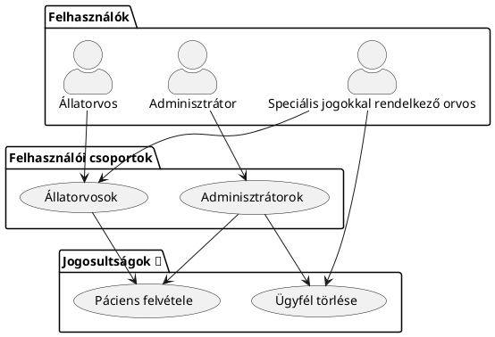

# Nem funkcionális követelmények (NFR)

## Biztonság

### Adatbiztonság
Minden érzékeny információt kifejezetten, ami a felhasználó azonosítására alkalmas titkosított formában kell eltárolni az adatbázisban

### Hitelesítés és jogosultságkezelés
Biztonságos bejelentkezési módszerek (felhasználónév/jelszó) használata kétfaktoros hitelesítési lehetőséggel és jelszó nélküli mobilos belépési opcióval. Szerepkör-alapú hozzáférés-vezérlés (RBAC) megvalósítása a felhasználók számára a megfelelő adathozzáférés érdekében.
> Passwordless bejelentkezés és a kétfaktoros hitelesítés elkészítése opcionális.
{style="note"}
#### Példa: RBAC Rendszer működésére {collapsible="true"}

> IAM és RBAC Rendszer működésének részletes leírását a technikai dokumentáció tartalmazza.
{style="warning"}

### Audit naplók
Nyilvántartást kell vezetni a rendszerhozzáférésekről és az adatok módosításáról, különösen az orvosi és tulajdonosi adatok tekintetében.

### Mobil biztonság
Biztosítani kell a mobil alkalmazások és a háttérrendszer közötti biztonságos kommunikációt, beleértve az adatok titkosítását és az eszközök biztonságát.

## Kapacitás
### Tárolási terv
A rendszernek képesnek kell lennie az orvosi feljegyzések, tulajdonosi információk és kezelési adatok tárolására több éven keresztül. A növekvő tárolási igényeket a páciensek számának növekedése és az adatok megőrzési politikája alapján kell tervezni.
> Tárolt adat mértéke nem haladhatja meg az Amazon RDS és S3 Free Tier limitjeit
{style="note"}

### Felhő/helyi szerver infrastruktúra
A szoftver futtatását lehetővé kell tenni mind lokális, és mind felhőbeli (Amazon AWS) környezetben.

> Kivételt képeznek ez alól az olyan esehetőségek, ahol a lokális környezetben a feltételek nem állnak rendelkezésre (pl.: internet hozzáférés)
{style="note"}

> A szoftver kódbázisának módosítása nélkül kell ezt lehetővé tenni.
{style="warning"}

> A szoftver futtatására felhasznált erőforrás nem haladhatja meg az Amazon AWS Free Tier limitációit.
{style="note"}

## Kompatibilizás

###  Operációs rendszerek támogatása
Biztosítani kell a kompatibilitást a Windows és az Android alapú operációs rendszerek támogatását.
> A mobilalkalmazás elkészítése opcionális.
{style="note"}

> A webes alkalmazás reszponzivitását biztosítani kell minden eszközön.
{style="warning"}

## Megbízhatóság és rendelkezésre állás
### Uptime követelmények
A rendszernek 99,9%-os rendelkezésre állással kell működnie, különösen a mobil alkalmazások esetében, amelyek sürgős feladatokat (pl. gyógyszerészeti értesítések) látnak el. A tervezett karbantartást munkaidőn kívül kell ütemezni.

### Hibatűrés
Hibatűrő mechanizmusokat kell bevezetni a magas rendelkezésre állás érdekében, és a kritikus hibák idejét maximum 1 órára kell korlátozni normál használat mellett.

### Adatintegritás
Biztosítani kell, hogy rendszerösszeomlás esetén se vesszenek el adatok, és valós idejű mentési mechanizmusok működjenek a kritikus adatoknál.

## Karbantarthatóság
### Folyamatos integráció/telepítés (CI/CD)
A rendszernek automatizált CI/CD "pipeline"-nal kell rendelkeznie, amely gyors frissítéseket és biztonsági javításokat tesz lehetővé.

### Dokumentáció
Teljes körű belső dokumentációt kell biztosítani a fejlesztők számára, részletes API-referenciával a külső integrációkhoz.

## Használhatóság
### Intuitív UI/UX kialakítás
A webes és mobil alkalmazásoknak felhasználóbarát, intuitív felülettel kell rendelkezniük mind a klinikai személyzet, mind a páciensek tulajdonosai számára.

### Reszponzív dizájn
A rendszer webes felületének reszponzívnak kell lennie, könnyen alkalmazkodva a különböző képernyőméretekhez, beleértve a tableteket és okostelefonokat is.

### Hozzáférhetőség
A webes hozzáférhetőségi szabványok (pl. WCAG) követése biztosítja, hogy a szoftver használható legyen fogyatékkal élők számára is.

### Oktatási és segédanyagok
Biztosítani kell egy segédszekciót oktatóanyagokkal, GYIK-kel és esetleg egy chatbotot az azonnali segítségnyújtáshoz a felhasználóknak.
